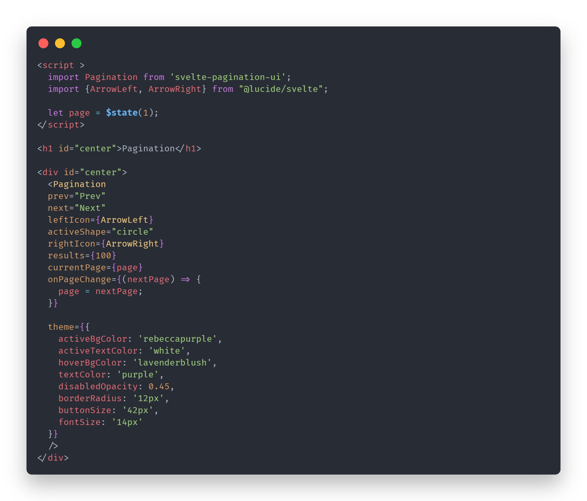
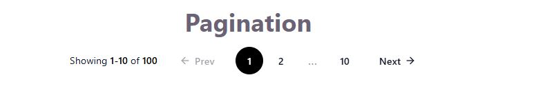
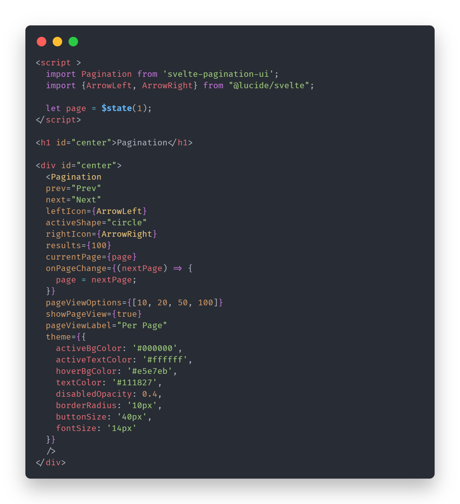
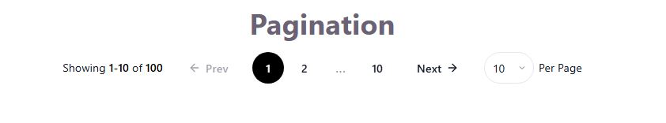
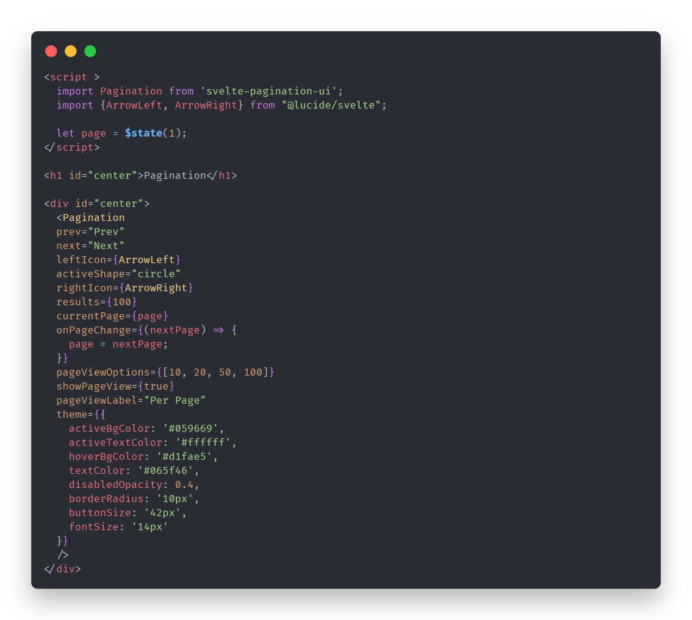
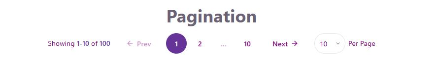

<div style="background-color: #5A6D6B; padding: 16px; border-radius: 8px; color: white;">
# Svelte Pagination

A small Svelte pagination component for libraries, dashboards, tables, and data-heavy views.

## Install

```bash
npm i svelte-pagination-ui
```

## Import

```svelte
<script lang="ts">
	import Pagination from 'svelte-pagination-ui';
</script>
```

## Basic usage

```svelte
<script lang="ts">
	import Pagination from 'svelte-pagination-ui';

	let page = $state(1);
</script>

<Pagination
	results={248}
	bind:currentPage={page}
	onPageChange={(nextPage) => {
		page = nextPage;
	}}
/>
```

`bind:currentPage` and `onPageChange` can be used together.

## Loading skeleton

Set `isLoading={true}` while you wait for data. The component will render a skeleton version instead of the interactive pagination controls.

```svelte
<Pagination
	isLoading={true}
	results={0}
	bind:currentPage={page}
/>
```

## Page size selector

```svelte
<Pagination
	results={248}
	bind:currentPage={page}
	bind:currentLength={pageSize}
	showPageView={true}
	pageViewOptions={[10, 20, 50, 100]}
	pageViewLabel="per page"
/>
```

## Icons and labels

You can customize the previous and next buttons with text labels or Svelte components.

```svelte
<script lang="ts">
	import Pagination from 'svelte-pagination-ui';
	import LeftIcon from './LeftIcon.svelte';
	import RightIcon from './RightIcon.svelte';
</script>

<Pagination
	results={248}
	bind:currentPage={page}
	prev="Previous"
	next="Next"
	leftIcon={LeftIcon}
	rightIcon={RightIcon}
/>
```

If `prev` or `next` is a string, that label is shown. If `leftIcon` or `rightIcon` is provided, the icon is rendered inside the button.

## Props

| Prop                | Type                              | Default             | Description                                               |
| ------------------- | --------------------------------- | ------------------- | --------------------------------------------------------- |
| `results`           | `number`                          | `0`                 | Total number of records.                                  |
| `currentLength`     | `number`                          | `10`                | Current page size. Can be used with `bind:currentLength`. |
| `currentPage`       | `number`                          | `1`                 | Current page. Can be used with `bind:currentPage`.        |
| `isLoading`         | `boolean`                         | `false`             | Shows the loading skeleton instead of the controls.       |
| `onPageChange`      | `(page: number) => void`          | `null`              | Fires when the page changes.                              |
| `onPageViewChange`  | `(pageSize: number) => void`      | `null`              | Fires when the page size changes.                         |
| `leftIcon`          | `ComponentType`                   | `null`              | Optional left icon component for the previous button.     |
| `rightIcon`         | `ComponentType`                   | `null`              | Optional right icon component for the next button.        |
| `prev`              | `string`                          | `null`              | Previous button label.                                    |
| `next`              | `string`                          | `null`              | Next button label.                                        |
| `isAnimated`        | `boolean`                         | `false`             | Enables active and button motion.                         |
| `enableHoverShrink` | `boolean`                         | `false`             | Shrinks page buttons on hover.                            |
| `activeShape`       | `square` \| `rounded` \| `circle` | `rounded`           | Controls active button shape.                             |
| `showPageView`      | `boolean`                         | `false`             | Shows the page size selector.                             |
| `pageViewOptions`   | `number[]`                        | `[10, 20, 50, 100]` | Options shown in the page size selector.                  |
| `pageViewLabel`     | `string`                          | `''`                | Optional label next to the selector.                      |
| `theme`             | `PaginationTheme`                 | `{}`                | Theme overrides.                                          |

## Theme

```ts
type PaginationTheme = {
	activeBgColor?: string;
	activeTextColor?: string;
	hoverBgColor?: string;
	textColor?: string;
	disabledOpacity?: number;
	borderRadius?: string;
	buttonSize?: string;
	fontSize?: string;
};
```

## Visuals


- ### Example - 1
   - Pagination Example without per page these is default theme and default style for pagination component 
  
  

- ### Example - 2

  
  

- ### Example - 3

  
  

- ### Example - 4

  
  

## Storybook

The package includes Storybook stories under `src/stories/Pagination.stories.svelte` so you can preview the default, animated, themed, icon-based, and loading skeleton variants.

</div>
